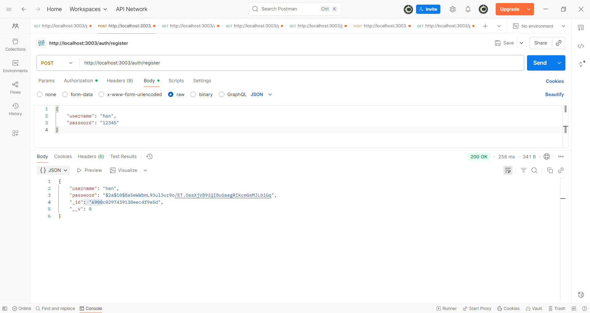
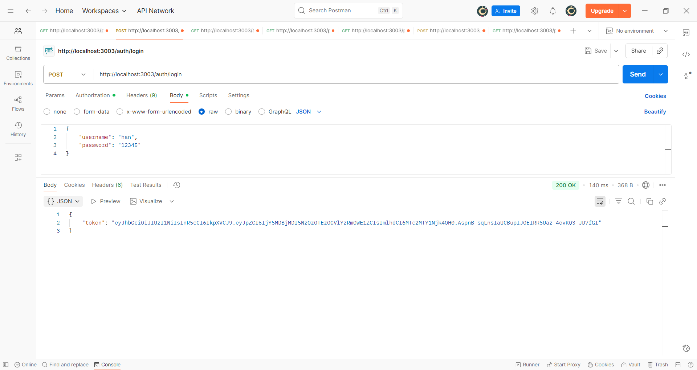
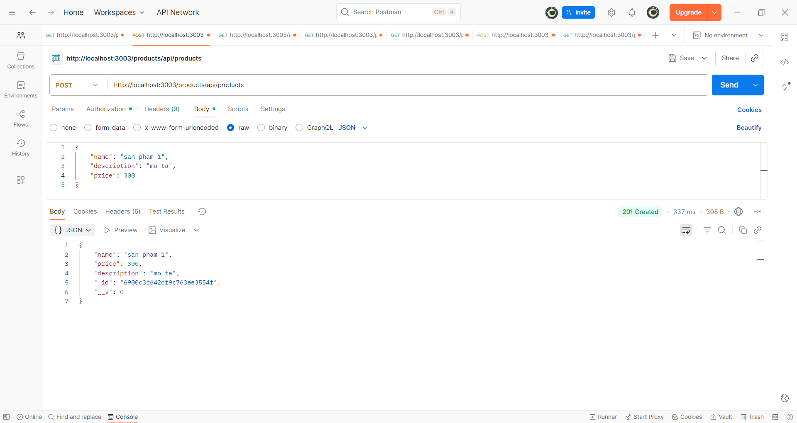
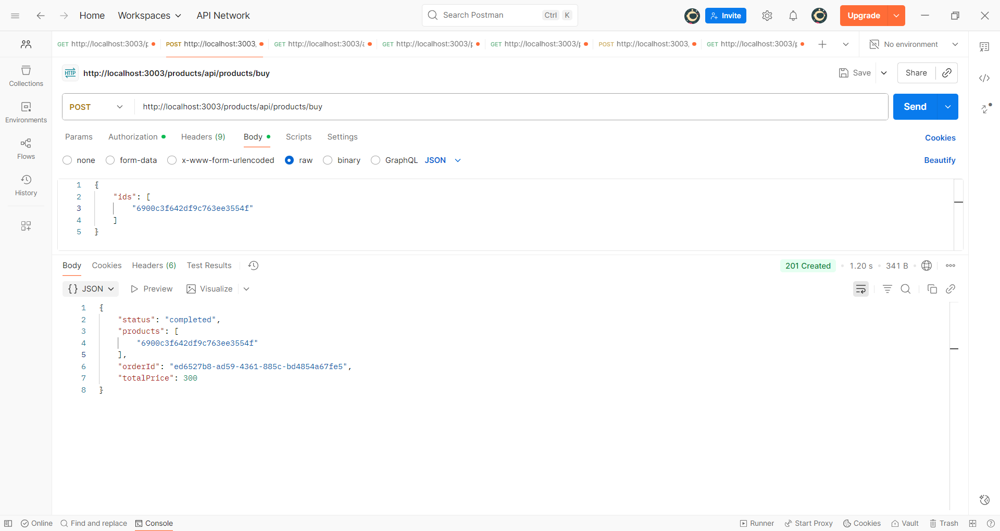

# 22660931-NguyenHongNgocHan-EProject

Dự án mô phỏng hệ thống thương mại điện tử cơ bản theo kiến trúc **Microservices**, gồm các chức năng:
- Đăng ký, đăng nhập người dùng
- Quản lý sản phẩm (thêm, xem, tìm theo ID)
- Thực hiện mua hàng / tạo đơn hàng
- Giao tiếp giữa các service qua **RabbitMQ**
- Lưu dữ liệu bằng **MongoDB**
- Triển khai và chạy qua **Docker Compose**

# 🚀 Cách chạy dự án

## 1️⃣ Cài đặt yêu cầu
- Cài đặt **Docker Desktop**
- Cài đặt **VS Code** (tuỳ chọn)

## 2️⃣ Chạy toàn bộ hệ thống
Trong thư mục gốc dự án, chạy lệnh:

```bash
docker compose up -d --build
```
## 3️⃣ Endpoints & How to test (POSTMAN)
### 1. Tạo tài khoản người dùng 
POST `http://localhost:3003/auth/register`
Body JSON:
```json
{ "username": "han", "password": "12345" }
```


### 2. Tiến hành đăng nhập thành công
POST `http://localhost:3003/auth/login`
Body JSON:
```json
{ "username": "han", "password": "12345" }
```


### 3. Tạo thông tin sản phẩm mới
POST `http://localhost:3003/products/api/products`
Body JSON:
```json
{ 
    "name": "san pham 1", 
    "description": "mo ta",
    "price": 300 }
```

### 4. Thực hiện thao tác đặt hàng
POST `http://localhost:3003/products/api/products/buy`
Body JSON:
```json
{ 
    "ids": [
        ""
    ] }
```


### 5. Xem thông tin sản phẩm bằng ID
GET `http://localhost:3003/products/api/products/buy`
